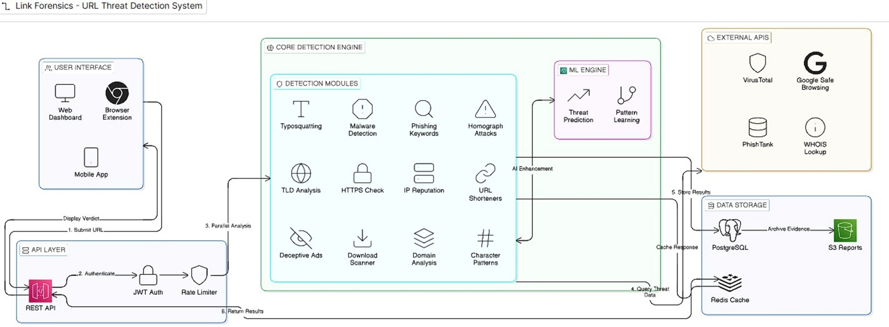
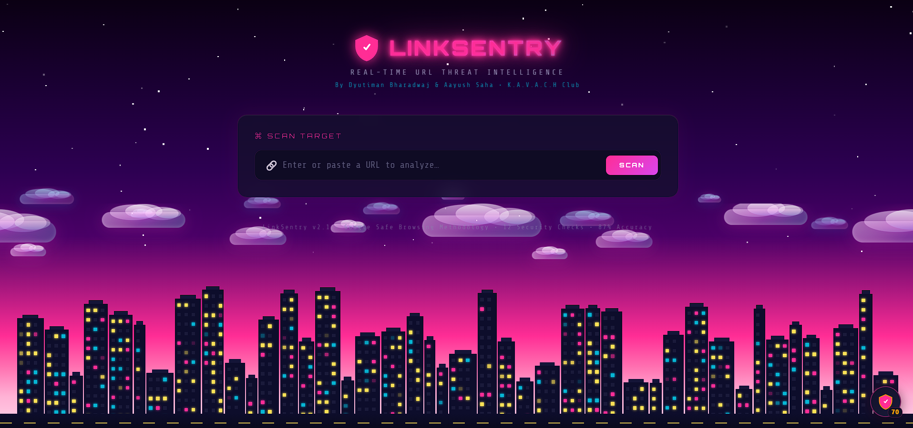
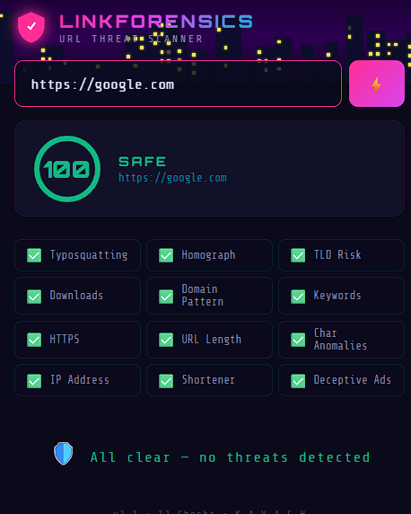
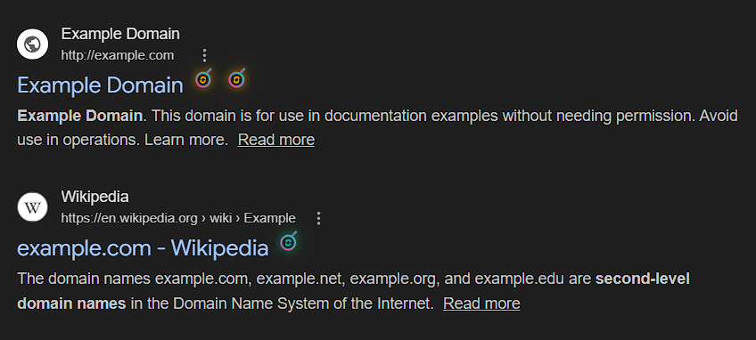

<div align="center">

# 🛡️ LinkForensics  
### Real-Time URL Threat Intelligence — Chrome Extension  

[](https://developer.chrome.com/docs/extensions/mv3/)  
[](https://developer.mozilla.org/en-US/docs/Web/JavaScript)  
[](LICENSE)  
[]()  

**12 security checks • Zero API calls • 100% client-side • Privacy-first**

*Detects phishing, typosquatting, homograph attacks, malware patterns, and more — directly in your browser.*

[Features](#-features) · [Installation](#-installation) · [How It Works](#-how-it-works) · [Security Checks](#-12-security-checks) · [Tech Stack](#-tech-stack) · [Contributing](#-contributing)

</div>

---

## ✨ Features

🔍 **Real-Time Scanning** — Every page you visit is analyzed in under 50ms  
🛡️ **Floating Shield Overlay** — Grammarly-style floating safety indicator  
🔎 **Google Search Badges** — Safety labels directly in search results  
⚡ **Popup Scanner** — Scan any pasted URL instantly  
🚨 **Interstitial Warning Page** — Blocks dangerous links before load  
🧠 **Educational Feedback** — Explains every detected threat  
🔒 **100% Privacy** — All logic runs locally  
📴 **Offline Capable** — Works without internet  

---

## 🌟 What Makes LinkForensics Different (USP)

Unlike typical URL checkers that rely on cloud APIs, LinkForensics performs **12 security checks entirely in-browser**, enabling:

- ⚡ Instant analysis with near-zero latency  
- 🔒 Zero data sharing, full privacy  
- 📴 Offline protection  
- 🧠 Explainable results for every risk flag  

This makes it suitable for privacy-sensitive users and restricted environments.

---

## 📸 UI Touchpoints

| Touchpoint | Description |
|:--:|---|
| 🟢 Floating Shield | Draggable overlay on every page showing safety status |
| 🔎 Search Badges | Safety labels injected into Google search results |
| 📊 Popup Scanner | Cyberpunk-themed popup with detailed threat breakdown |
| 🚨 Warning Page | Full-screen interstitial for dangerous URLs |

---

## 🚀 Installation

### From Source (Developer Mode)

```bash
git clone https://github.com/DYUTIMAN03/Link_Forensics.git
cd Link_Forensics
```
## ⚡ Quick Start (For users)

1. Load the extension via `chrome://extensions` (Developer Mode → Load unpacked → `url-safety-extension/`)
2. Open any website (e.g., https://google.com)
3. Click the LinkForensics icon to view the safety score  
4. Try pasting a URL in the popup to scan manually

*Takes under 1 minute to test the core features.*
⚙️ How It Works

User opens URL
→ Intercept via Chrome API
→ Run 12 security checks
→ Compute score (0–100)
→ Show result in overlay, popup, badges, or warning page

---

### Scoring

| Score | Status | Action |
|------:|:------:|:------|
| 80–100 | Safe | Normal browsing |
| 60–79 | Caution | Warning shown |
| 0–59 | Dangerous | Alert |
| ≤ 40 | Blocked | Interstitial |

---

## 🔬 12 Security Checks

| # | Check | Detects | Risk |
|:-:|------|---------|:---:|
| 1 | Typosquatting Detection | Fake domains mimicking real sites | 🔴 High |
| 2 | Homograph Attack | Unicode spoofing of characters | 🔴 High |
| 3 | High-Risk TLD | `.zip`, `.tk`, `.xyz` | 🟡 Medium |
| 4 | Download Trap | `.exe`, `.apk`, `.scr` | 🔴 High |
| 5 | Domain Pattern Analysis | Random strings | 🟡 Medium |
| 6 | Phishing Keywords | "verify", "login" | 🟡 Medium |
| 7 | HTTPS Check | Missing SSL | 🟡 Medium |
| 8 | Long URLs | Obfuscation | 🟢 Low |
| 9 | Special Characters | `@`, `//` abuse | 🟡 Medium |
| 10 | IP URLs | Raw IP usage | 🔴 High |
| 11 | URL Shorteners | Hidden targets | 🟢 Low |
| 12 | Deceptive Ads | Click fraud | 🟡 Medium |

---

## 🧭 Architecture



**Flow (client-side only):**  
User visits URL →  
Chrome intercepts navigation →  
12 security checks run locally →  
Score computed (0–100) →  
Result shown via overlay, popup, badges, or warning page  

No external APIs. No server. 100% in-browser analysis.

---

## 🛠️ Tech Stack

| Layer | Technology |
|------|------------|
| Platform | Chrome Extension (Manifest V3) |
| Language | JavaScript (ES6+) |
| UI | HTML + CSS |
| APIs | webNavigation, tabs, storage |
| Architecture | Event-driven Service Worker |

---

## 🗺️ Roadmap

- [ ] ML-based URL classifier  
- [ ] Safe Browsing API (optional)  
- [ ] Hover safety preview  
- [ ] Gmail link scanning  
- [ ] Crowdsourced threat DB  
- [ ] Firefox support

---

## ⚠️ Current Limitations

- Heuristic-based detection may miss brand-new zero-day phishing domains  
- No live reputation feeds (by design, to preserve privacy)  
- Does not yet scan links inside emails or PDFs  
- Accuracy depends on rule coverage and curated domain lists  

Future versions aim to complement local checks with optional reputation services.

---

👥 Team
| Name               | Role      |
| ------------------ | --------- |
| Dyutiman Bharadwaj | Developer |
| Aayush Saha        | Developer |

---

## 📸 Preview

### Demo (Standalone Scanner)


### Chrome Extension (Popup / Overlay)


*Screenshots show example scans using safe public URLs for demonstration.*

### Google Search Badges (Inline Safety Labels)


*Safety badges injected into Google Search results for instant risk awareness.*

**Tested on:** Chrome 120+, Edge 120+, Brave 1.60+ (Windows 10/11)

---

📄 License

MIT License

---

<div align="center">

LINKFORENSICS v2.1
Making the web safer, one URL at a time 🛡️

</div> ```
